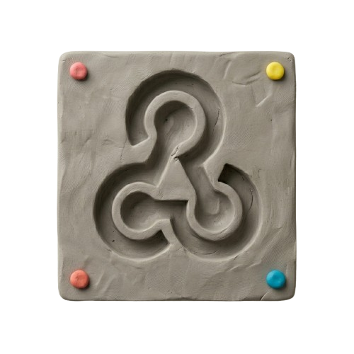

<p align="center">
  
</p>

<h1 align="center">Mold</h1>

<p align="center">
  Webhook bridge for chaining Clay tables.
</p>

<p align="center">
  <a href="LICENSE"></a>
</p>

---

## What it does

Mold sits between two Clay tables and bridges them synchronously:

```
Table A (HTTP API column)
  → POST to Mold
    → Mold forwards payload to Table B's webhook
      → Table B runs all its columns
        → Table B's HTTP API column POSTs result back to Mold
          → Mold returns the result as the response to Table A
```

Table A sends data, Table B enriches it, Table A gets the enriched result back in a single request/response cycle. No polling, no queues, no database.

## Getting started

### Step 1: Generate your API token

Open your terminal and run:

```bash
openssl rand -hex 32
```

Copy the output. This is your `API_TOKEN` — you'll use it in the next step and when configuring Clay.

### Step 2: Deploy

Pick a platform and click to deploy:

[](https://render.com/deploy?repo=https://github.com/eliasstravik/mold)
&nbsp;&nbsp;
[](https://railway.com/new/template?template=https://github.com/eliasstravik/mold)

<details>
<summary><b>Render step-by-step</b></summary>

1. Click the **Deploy to Render** button above
2. Sign in to Render (or create a free account)
3. You'll see a **"Blueprint Name"** field — you can name it anything (e.g. `mold`), it doesn't matter
4. Below that you'll see environment variables. Find `API_TOKEN` and paste the token you generated in Step 1
5. Leave all other fields as they are — the defaults are fine. Render reads the `render.yaml` file automatically, so you don't need to configure anything else
6. Click **Apply**
7. Wait for the deploy to finish (usually under a minute). You'll see the status turn green
8. Click on your service name. Your server URL is shown near the top of the page, something like `https://mold-xxxx.onrender.com`
9. Copy that URL — you'll need it for Clay

> **Note:** Render's free tier spins down after inactivity. The first request after a cold start takes ~30 seconds. If this is a problem, upgrade to their paid tier or use Railway.

</details>

<details>
<summary><b>Railway step-by-step</b></summary>

1. Click the **Deploy on Railway** button above
2. Sign in to Railway (or create an account)
3. If asked to name the project, pick anything you like (e.g. `mold`)
4. Railway will show you the environment variables. Find `API_TOKEN` and paste the token you generated in Step 1
5. Leave everything else as-is — Railway detects the project setup automatically from the repo
6. Click **Deploy**
7. Wait for the build to finish (usually under two minutes)
8. Once deployed, go to your service → **Settings → Networking → Generate Domain**
9. Railway will assign a public URL like `https://mold-production-xxxx.up.railway.app`
10. Copy that URL — you'll need it for Clay

> **Note:** If Railway asks about a config file or Dockerfile, you don't need to select anything — it auto-detects from the repo.

</details>

<details>
<summary><b>Docker / VPS / other</b></summary>

```bash
git clone https://github.com/eliasstravik/mold.git
cd mold
npm install
npm run build
API_TOKEN=your-token-from-step-1 npm start
```

Or with Docker:

```bash
docker build -t mold .
docker run -p 3000:3000 -e API_TOKEN=your-token-from-step-1 mold
```

Your server URL is whatever domain or IP points to your server (e.g. `https://mold.fly.dev`).

</details>

### Step 3: Get your Table B webhook URL

1. In Clay, open (or create) the table that will do the enrichment work — this is **Table B**
2. Table B needs to be set up to receive data via webhook. Click **Add Source** (or check your existing source) and select **Webhook**
3. Clay will show you a webhook URL. It looks something like:
   ```
   https://api.clay.com/v3/sources/webhook/abc123def456
   ```
4. Copy that URL — you'll paste it into Table A in the next step

### Step 4: Configure Table A (the table that sends data)

This is where you send data out to be enriched. You'll add an HTTP API column that sends each row's data to Mold.

1. Open your Table A in Clay
2. Click **Add Column** and select **HTTP API**
3. Configure the HTTP API column with these exact settings:

**Method:** `POST`

**URL:** Paste your Mold server URL from Step 2 and add `/bridge` at the end. For example, if your Mold URL is `https://mold-a1b2.onrender.com`, the full URL would be:
```
https://mold-a1b2.onrender.com/bridge
```

**Headers:** Click "Add Header" and add exactly one header:
- **Key:** `Authorization`
- **Value:** `Bearer YOUR_API_TOKEN`

Replace `YOUR_API_TOKEN` with the actual token you generated in Step 1. Make sure to include the word `Bearer` followed by a space before the token. For example, if your token is `e4f9a1...`, the full value would be `Bearer e4f9a1...`.

**Body:** This is the data you want to send to Table B for enrichment. It's a JSON object with these parts:

1. **`_mold_target_url`** (required) — tells Mold where to forward the data. Use the Table B webhook URL you copied in Step 3
2. **`_mold_target_auth_token`** (optional) — if Table B's webhook has an authentication token enabled, include it here. Mold will send it in the `x-clay-webhook-auth` header when forwarding to Table B
3. **Your actual data** — the fields you want Table B to work with. Use the `{}` button or type `/` in Clay to insert column references from Table A

For example, say Table A has columns called "First Name", "Email", and "Company". Your body would look like:

```json
{
  "_mold_target_url": "https://api.clay.com/v3/sources/webhook/abc123def456",
  "first_name": "{{First Name}}",
  "email": "{{Email}}",
  "company": "{{Company}}"
}
```

Or if Table B's webhook requires auth:

```json
{
  "_mold_target_url": "https://api.clay.com/v3/sources/webhook/abc123def456",
  "_mold_target_auth_token": "table-b-auth-token-here",
  "domain": "{{Company Domain}}"
}
```

A few things to note:
- Replace the `_mold_target_url` value with the actual Table B webhook URL from Step 3
- `_mold_target_auth_token` is optional — only include it if Table B's webhook requires it
- To insert column references, either click the `{}` button or type `/` in any field in Clay's HTTP API column editor — they look like `{{Column Name}}`
- You can include as many or as few data fields as you want — whatever Table B needs to do its job
- Mold strips both `_mold_target_url` and `_mold_target_auth_token` before forwarding, so Table B only receives the actual data fields

### Step 5: Send a test row from Table A

Before you can configure Table B's response column, you need to fire at least one request so that Table B receives the data and creates the columns you'll reference.

1. Go back to Table A
2. Make sure there's at least one row with data in it
3. Run that row (or the whole table) so the HTTP API column fires
4. The request will hit Mold, which forwards it to Table B — **this first request will time out, and that's expected**. The point is just to get the data into Table B so the columns show up

Now go to Table B. You should see a new row with the data you sent from Table A, plus a `_mold_callback_url` column that Mold injected. You'll need this column in the next step.

### Step 6: Configure Table B (the table that enriches and responds)

Table B now has the forwarded data from Mold. You can add whatever enrichment columns you want (lookups, AI, etc.). Once those are set up, you need to add an HTTP API column as the **very last column** to send the results back.

1. Open Table B in Clay
2. Add whatever enrichment/processing columns you need — these will run before the final HTTP API column
3. Click **Add Column** and select **HTTP API** — add it as the **last column** in the table
4. Configure it with these exact settings:

**Method:** `POST`

**URL:** Click the `{}` button (or type `/`) and select the `_mold_callback_url` column. This column was automatically created when Mold forwarded the data from Table A — it contains a unique URL like `https://mold-a1b2.onrender.com/callback/d4e5f6-...` that routes the result back to the correct request. Your URL field should show:
```
{{_mold_callback_url}}
```

**Headers:** Click "Add Header" and add exactly one header:
- **Key:** `Authorization`
- **Value:** `Bearer YOUR_API_TOKEN` (the **same token** from Step 1 — same as Table A)

**Body:** This is the enriched data you want sent back to Table A. Use the `{}` button or type `/` to reference Table B's columns — including any enrichment columns you added. For example:

```json
{
  "name": "{{Name}}",
  "email": "{{Email}}",
  "company": "{{Company}}",
  "enriched_title": "{{Job Title}}",
  "enriched_industry": "{{Industry}}"
}
```

Whatever you put in this body is exactly what Table A will receive back as the response to its HTTP API column.

### Step 7: Test the full flow

Now that both tables are configured, run a row in Table A again. This time the full round-trip should work:

1. Table A sends the data to Mold (`https://mold-a1b2.onrender.com/bridge`)
2. Mold forwards it to Table B
3. Table B runs all its columns (including your enrichment columns)
4. Table B's final HTTP API column sends the result back to Mold (using `_mold_callback_url`)
5. Mold returns the result to Table A

Table A's HTTP API column will now show the enriched response. You can reference these fields in subsequent columns in Table A.

### That's it

You're done. From now on, every row that runs in Table A will automatically go through Table B and come back enriched.

### Environment variables

Only `API_TOKEN` is required. The rest are optional tuning knobs:

| Variable | Required | Default | Description |
|----------|----------|---------|-------------|
| `API_TOKEN` | Yes | | Bearer token for authenticating requests |
| `TIMEOUT_MS` | No | `300000` | Max ms to wait for callback (default 5 min) |
| `MAX_PENDING` | No | `100` | Max concurrent pending requests |
| `PORT` | No | `3000` | Server port |

## How it works

Mold is a single-file Hono server (~170 lines) with two endpoints:

- **`POST https://your-mold-server.com/bridge`** (authenticated) receives Table A's request, generates a unique callback URL, forwards the payload to Table B, and holds the connection open until Table B responds.

- **`POST https://your-mold-server.com/callback/:id`** (authenticated, same bearer token) receives Table B's completed result and routes it back to the waiting Table A connection. You never call this directly — Mold generates the full URL (e.g. `https://mold-a1b2.onrender.com/callback/d4e5f6...`) and injects it into the payload as `_mold_callback_url`.

Request parking uses an in-memory Map of Promise resolvers. This means Mold runs as a single process. If you need horizontal scaling, you would need shared state (Redis, etc.), but for most Clay workflows a single instance is more than sufficient.

## Development

```bash
npm install
npm run dev
```

| Command | Description |
|---------|-------------|
| `npm run dev` | Start dev server with hot reload |
| `npm run build` | Type-check and production build |
| `npm start` | Run production build |

## Architecture

Built with [Hono](https://hono.dev) and TypeScript. Two production dependencies. Deploys anywhere that runs Node.js.

```
src/
  index.ts    The entire server
```

### Security measures

- Bearer token auth on all endpoints
- 1MB body size limit on all endpoints
- Request capacity cap (default 100 concurrent)
- Forward timeout (30s) with AbortSignal
- Timing-safe token comparison (Hono built-in)
- Callback UUIDs are cryptographically random and never logged

## Contributing

See [CONTRIBUTING.md](CONTRIBUTING.md) for development setup and guidelines.

## Security

See [SECURITY.md](SECURITY.md) for the security model and how to report vulnerabilities.

## License

[MIT](LICENSE)
