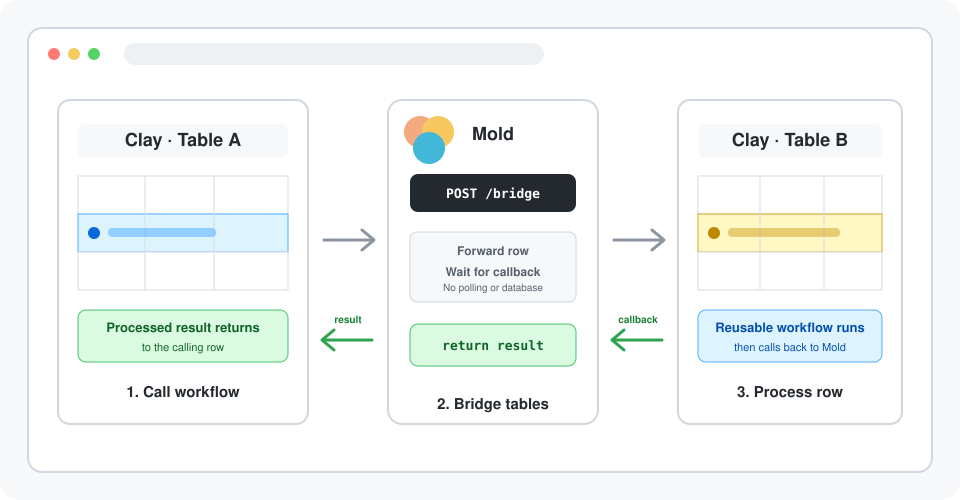

<h3 align="center">Reuse Clay workflows without rebuilding columns or copying results between tables</h3>

Mold lets you call the same processing table from every Clay workflow when repeated logic starts spreading across campaigns, by forwarding each row into one reusable table and returning the processed result to the calling HTTP API column.

&nbsp;&nbsp;

✓&nbsp;100%&nbsp;free&nbsp;and&nbsp;open&nbsp;source &nbsp; ✓&nbsp;No&nbsp;database&nbsp;or&nbsp;queue &nbsp; ✓&nbsp;Works&nbsp;with&nbsp;Clay&nbsp;HTTP&nbsp;and&nbsp;webhook&nbsp;columns

<small>⭐ Used by top GTM Engineers</small>

 

## Keep one Clay workflow useful everywhere

A process built in one table is available to every campaign that needs it. The logic stays in one place, and each calling row receives the finished result where its own workflow can continue.

## Choose between duplicated columns, manual handoffs, custom middleware — or one Clay workflow every table can call

| | **Mold** | Duplicated columns | Manual handoffs | Custom bridge |
|---|:---:|:---:|:---:|:---:|
| **Free software** | ✅ | ✅ | ✅ | ✅ |
| **No custom code** | ✅ | ✅ | ✅ | ❌ |
| **Works with existing Clay tables** | ✅ | ✅ | ✅ | ✅ |
| **Reusable processing table** | ✅ | ❌ | ✅ | ✅ |
| **Returns cross-table result to caller** | ✅ | ❌ | ❌ | ✅ |
| **No polling or queue** | ✅ | ✅ | ❌ | ✅ |
| **Bearer token authentication** | ✅ | ❌ | ❌ | ✅ |
| **Configurable timeout and capacity** | ✅ | ❌ | ❌ | ✅ |
| **One-click deployment** | ✅ | ❌ | ❌ | ❌ |

Build the process once in Clay and call it where it is needed. Mold handles the round trip, the reusable table handles the work, and the result returns to the calling row.

## Call one Clay table from another. Get the processed result back in the same step.

### 📈 Keep shared logic in one table

Put the enrichment, scoring, or transformation steps in one processing table. Every calling workflow can use the same live version.

### ⚡ Let Mold handle the round trip

Mold forwards the row to the processing table, waits for its callback, and returns the callback body to the original HTTP API column.

### 💬 Connect the next workflow to the same table

Point another Clay HTTP API column at Mold and name the existing processing table webhook as its target. No columns need to be copied.

## Connect your first two Clay tables in fifteen minutes

<table>
<tr>
<td align="center" valign="top" width="33%"><h3>1️⃣</h3><b>Deploy Mold</b> Generate an API token, deploy on Render or Railway, and copy the service URL.</td>
<td align="center" valign="top" width="33%"><h3>2️⃣</h3><b>Prepare the processing table</b> Use a webhook source for the input and a final HTTP API column for Mold's callback.</td>
<td align="center" valign="top" width="33%"><h3>3️⃣</h3><b>Call it from another table</b> Post the row to Mold and use the processed response in the columns that follow.</td>
</tr>
</table>

## Choose how to get started

<table>
<tr>
<td align="center" valign="top" width="50%"><h3>Self-serve</h3>For GTM engineers who build in Clay <h2>Free</h2>
&nbsp;&nbsp;&nbsp;✓&nbsp; Synchronous bridge and callback endpoints &nbsp;&nbsp;&nbsp;✓&nbsp; Bearer token authentication &nbsp;&nbsp;&nbsp;✓&nbsp; Configurable request timeout and capacity &nbsp;&nbsp;&nbsp;✓&nbsp; Request body and forward-time limits &nbsp;&nbsp;&nbsp;✓&nbsp; Render, Railway, Docker, or Node deployment &nbsp;&nbsp;&nbsp;✓&nbsp; No database, queue, or polling service
</td>
<td align="center" valign="top" width="50%"><h3>Done-with-you</h3>Hands-on setup and ongoing support for your GTM team <h2>Let's talk</h2>
&nbsp;&nbsp;&nbsp;✓&nbsp; Everything in self-serve &nbsp;&nbsp;&nbsp;✓&nbsp; Full setup and deployment &nbsp;&nbsp;&nbsp;✓&nbsp; API token and environment configuration &nbsp;&nbsp;&nbsp;✓&nbsp; Mold connected to your existing Clay tables &nbsp;&nbsp;&nbsp;✓&nbsp; Team rollout, training, and best practices &nbsp;&nbsp;&nbsp;✓&nbsp; Ongoing maintenance and upgrades &nbsp;&nbsp;&nbsp;✓&nbsp; Dedicated Slack channel support
</td>
</tr>
<tr>
<td align="center"></td>
<td align="center"></td>
</tr>
</table>

## Get your questions answered

### Do I need to know how to code?

No code is needed to deploy Mold from the Render blueprint or Railway template. You still need to configure HTTP API columns in the two Clay tables.

### What does Mold do between the two tables?

Table A posts a row and Table B's webhook URL to Mold. Mold forwards the row with a unique callback URL, waits for Table B's final HTTP API column to call it, then returns that body to Table A.

### Does Mold store my Clay data?

No durable database is used. Pending request state exists only in the running process and is removed after the callback or timeout.

### What happens if the processing table is slow?

Mold waits up to five minutes by default, and you can change that with `TIMEOUT_MS`. The initial forward to Table B must be accepted within 30 seconds.

### Can I run more than one Mold instance behind a load balancer?

No. Pending callbacks live in the memory of one process, so requests and callbacks must reach the same instance.

### Can Table B's webhook require authentication?

Yes. Include its optional auth token in the bridge request and Mold sends it in Clay's `x-clay-webhook-auth` header.

### What does it cost?

Mold is free and MIT licensed. You pay only for the infrastructure where you deploy it and the Clay or data services used by your workflows.

## Connect your first two Clay tables in fifteen minutes

A reusable Clay workflow can serve another table after one deployment and two HTTP API columns. Mold handles the request and response. You choose the table that does the work.

&nbsp;&nbsp;

✓&nbsp;100%&nbsp;free&nbsp;and&nbsp;open&nbsp;source &nbsp; ✓&nbsp;No&nbsp;database&nbsp;or&nbsp;queue &nbsp; ✓&nbsp;Works&nbsp;with&nbsp;Clay&nbsp;HTTP&nbsp;and&nbsp;webhook&nbsp;columns

<small>⭐ Used by top GTM Engineers</small>

